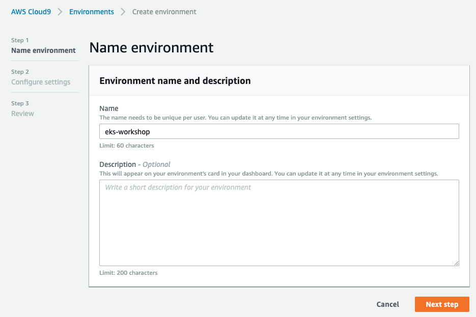
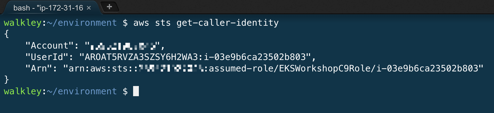

# EKS Workshop 动手实验说明

本文档目的是指导用户熟悉建立Amazon EKS集群的过程，并利用AWS相关的服务和插件部署一套常见应用程序。

部署流程如下：

## 1. 准备工作
### a. 请确保您有海外AWS账号和足够的资源配额
- 请确保您有创建海外AWS账号的IAM user，该用户有Administrator权限。
### b. 准备Cloud9所需要的VPC
- 可以使用默认的VPC或者创建新的VPC, 可以参考[这个文档](https://docs.aws.amazon.com/zh_cn/vpc/latest/userguide/VPC_Scenario1.html#VPC_Scenario1_Implementation)创建新的VPC。

## 2. 创建Cloud9
点击[这里](https://ap-southeast-1.console.aws.amazon.com/cloud9/home/create)启动Cloud9开发环境
填入Cloud9名称，Next Step进入到下一步：


其它步骤可以保持默认参数不变，最后一步点击Create Environment. Cloud9新环境创建需要一分钟左右。

## 3. 配置Cloud9环境
- 在Cloud9 terminal窗口中执行如下命令，创建新的EC2 instance profile并配置给当前Cloud9实例。
  ```
  $ aws iam create-role --role-name EKSWorkshopC9Role --assume-role-policy-document https://raw.githubusercontent.com/walkley/eks-workshop/master/eks-workshop/ec2-role-trust-policy.json
  $ aws iam attach-role-policy --role-name EKSWorkshopC9Role --policy-arn arn:aws:iam::aws:policy/arn:aws:iam::aws:policy/AdministratorAccess
  $ aws iam create-instance-profile --instance-profile-name EKSWorkshopC9InstanceProfile
  $ aws iam add-role-to-instance-profile --role-name EKSWorkshopC9Role --instance-profile-name EKSWorkshopC9InstanceProfile
  $ MYINSTID=$(curl -sS http://169.254.169.254/latest/meta-data/instance-id)
  $ aws ec2 associate-iam-instance-profile --instance-id $MYINSTID --iam-instance-profile Name=EKSWorkshopC9InstanceProfile
  ```

- 禁用掉managed temporary credentials：
  

  正确配置完成后，运行`aws sts get-caller-identity`将会看到如下类似json输出。
  

- 下载 `kubectl`

   ```bash
  $ sudo curl -o /usr/local/bin/kubectl https://amazon-eks.s3-us-west-2.amazonaws.com/1.13.7/2019-06-11/bin/linux/amd64/kubectl
  $ sudo chmod +x /usr/local/bin/kubectl
   ```

- 下载 `eksctl`

   ```bash
  $ curl -sL "https://github.com/weaveworks/eksctl/releases/download/latest_release/eksctl_$(uname -s)_amd64.tar.gz" | tar xz -C /tmp
  $ sudo mv /tmp/eksctl /usr/local/bin
   ```

- 下载 `aws-iam-authenticator`

   ```bash
  $ sudo curl -o /usr/local/bin/aws-iam-authenticator https://amazon-eks.s3-us-west-2.amazonaws.com/1.13.7/2019-06-11/bin/linux/amd64/aws-iam-authenticator
  $ sudo chmod +x /usr/local/bin/aws-iam-authenticator
   ```

## 4. 创建EKS集群
- 运行如下命令，用eksctl创建一个包含默认node group的集群：
  ```bash
  $ sudo yum install -y jq
  $ REGION=`curl -sS http://169.254.169.254/latest/dynamic/instance-identity/document | jq -r .region`
  $ eksctl create cluster --region $REGION --name eks-workshop --alb-ingress-access
  ```

  更多参数可参考[eksctl官方文档](https://eksctl.io/)。
  
  所有资源创建可能需要15分钟左右。

## 5. 配置Helm环境
- 安装helm cli，创建tiller namespace:
  ```bash
  $ curl -L https://git.io/get_helm.sh | bash
  $ kubectl create namespace tiller
  ```
- 启动本地tiller server:
  ```bash
  $ export TILLER_NAMESPACE=tiller
  $ tiller -listen=localhost:44134 -storage=secret -logtostderr
  ```
- 不要关闭上述命令行窗口，在旁边启动一个新tab页命令行窗口，运行下面的命令以初始化本地heml环境:
  ```bash
  $ export HELM_HOST=:44134
  $ helm init --client-only
  $ helm repo update
  ```
  
## 5. 创建示例应用程序 2048小游戏
在本部分中，您将创建一个2048小游戏来测试新集群。
  ```bash
  $ kubectl apply -f https://raw.githubusercontent.com/kubernetes-sigs/aws-alb-ingress-controller/master/docs/examples/2048/2048-namespace.yaml
  $ kubectl apply -f https://raw.githubusercontent.com/kubernetes-sigs/aws-alb-ingress-controller/master/docs/examples/2048/2048-deployment.yaml
  $ kubectl apply -f https://raw.githubusercontent.com/kubernetes-sigs/aws-alb-ingress-controller/master/docs/examples/2048/2048-service.yaml
  ```

## 6. 创建AWS ALB Ingress controller
### a. 部署 ALB ingress controller
  ```bash
  $ helm repo add incubator http://storage.googleapis.com/kubernetes-charts-incubator
  $ helm repo update
  $ helm install incubator/aws-alb-ingress-controller \
  --set clusterName=eks-workshop \
  --set autoDiscoverAwsRegion=true \
  --set autoDiscoverAwsVpcID=true
  ```

### b. 部署 ingress
下载ingress YAML:
```bash
$ curl -sS https://raw.githubusercontent.com/kubernetes-sigs/aws-alb-ingress-controller/master/docs/examples/2048/2048-ingress.yaml -o 2048-ingress.yaml
```
编辑 `2048-ingress.yaml` 文件, 在annotations中增加 `alb.ingress.kubernetes.io/target-type: ip`. 本示例中我们将用`ip mode` 作为目标类型，这样ALB的流量将会直接转发到Pod上。

然后创建ingress
```bash
$ kubectl apply -f 2048-ingress.yaml
```

获取ingress资源的`Address`属性：
```bash
$ kubectl -n 2048-game describe ing/2048-ingress
```


### c. 用浏览器打开上一步的ALB地址，开始您的2048游戏之旅！


## 7. Amazon EKS结合Amazon EC2 Spot
  参考[此文档](https://walkley.github.io/eks-workshop/spot/)以创建基于spot fleet的EKS集群。

## 8. 清理环境
### a. 删除ingress
  ```bash
  $ kubectl delete -f 2048-ingress.yaml
  ```
### b. 删除EKS集群
  ```bash
  $ eksctl delete cluster eks-workshop --region $REGION
  ```
