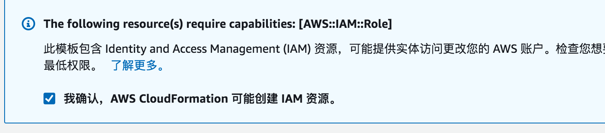
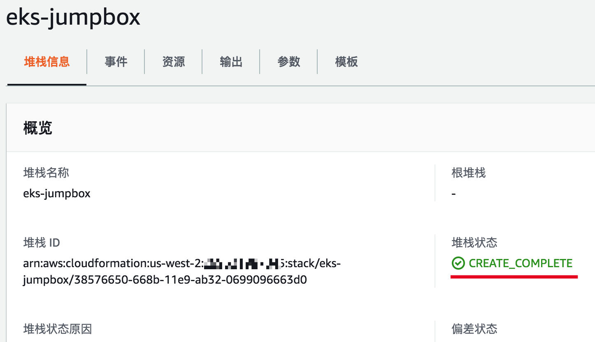
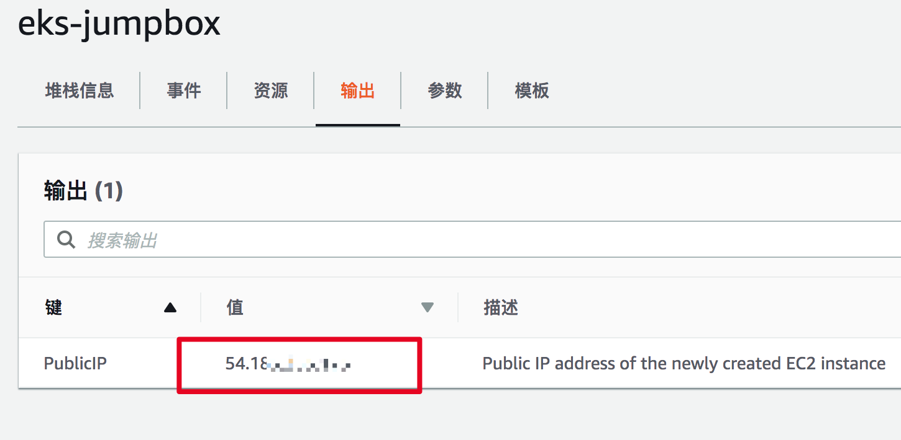
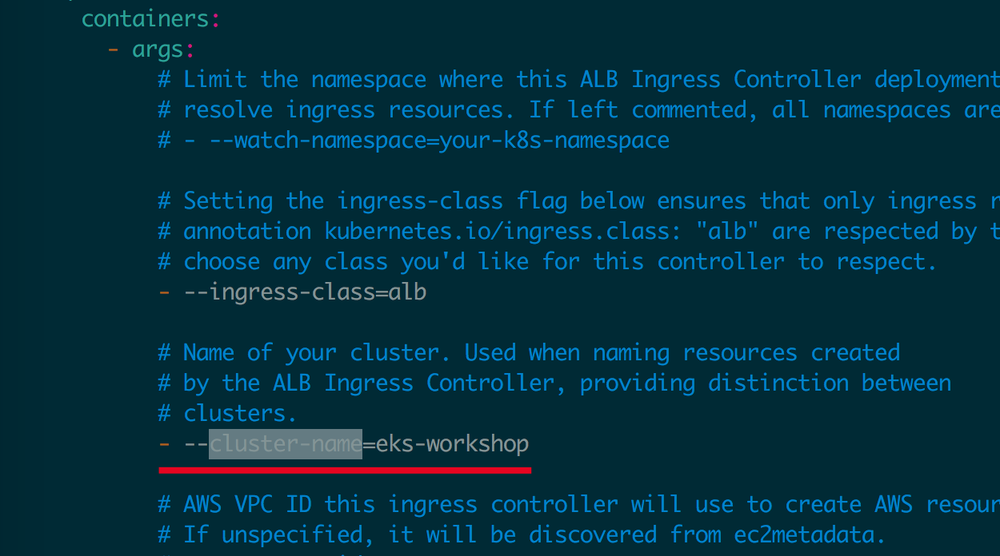
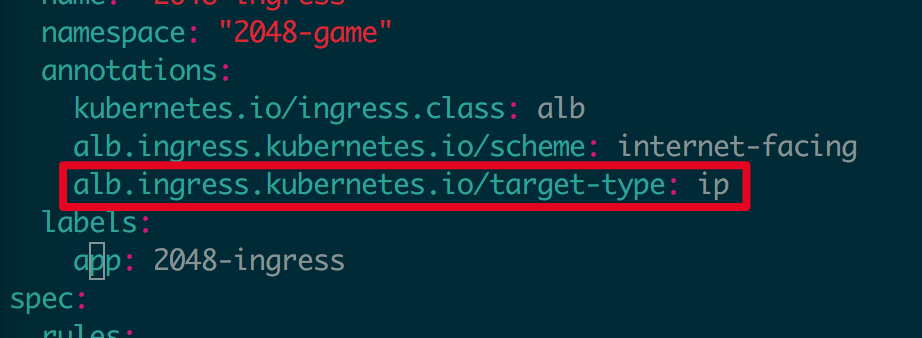
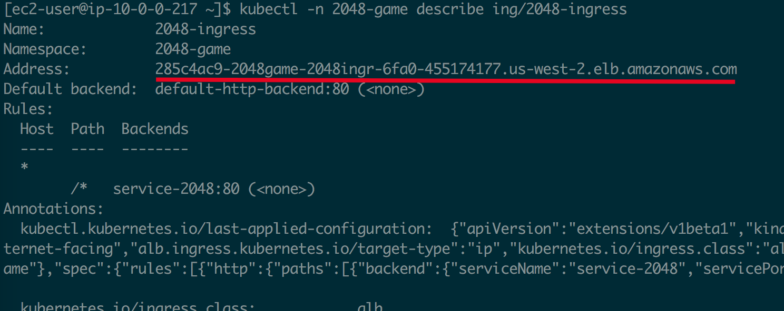
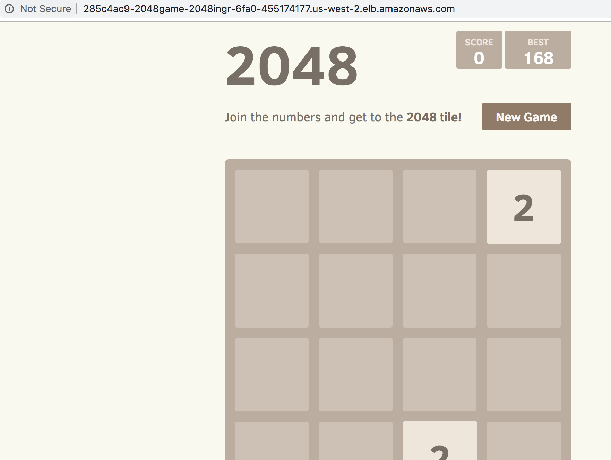

# EKS Workshop 动手实验说明

本文档目的是指导用户熟悉建立Amazon EKS集群的过程，并利用AWS相关的服务和插件部署一套常见应用程序。

部署流程如下：

## 1. 准备工作
### a. 请确保您有海外AWS账号和足够的资源配额
- 请确保您有海外AWS账号的IAM user，该用户有创建相关资源的权限。
### b. 准备跳板机所需要的VPC
- 可以使用默认的VPC或者创建新的VPC, 可以参考[这个文档](https://docs.aws.amazon.com/zh_cn/vpc/latest/userguide/VPC_Scenario1.html#VPC_Scenario1_Implementation)创建新的VPC。

## 2. 创建跳板机
请点击如下链接在各AWS区域创建跳板机：

[Virginia](https://console.aws.amazon.com/cloudformation/home?region=us-east-1#/stacks/new?stackName=eks-jumpbox&templateURL=https://s3-ap-southeast-1.amazonaws.com/whe-pub/eks-workshop/jumpbox-eks.yaml)

[Ohio](https://console.aws.amazon.com/cloudformation/home?region=us-east-2#/stacks/new?stackName=eks-jumpbox&templateURL=https://s3-ap-southeast-1.amazonaws.com/whe-pub/eks-workshop/jumpbox-eks.yaml)

[N California](https://console.aws.amazon.com/cloudformation/home?region=us-west-1#/stacks/new?stackName=eks-jumpbox&templateURL=https://s3-ap-southeast-1.amazonaws.com/whe-pub/eks-workshop/jumpbox-eks.yaml)

[Oregon](https://console.aws.amazon.com/cloudformation/home?region=us-west-2#/stacks/new?stackName=eks-jumpbox&templateURL=https://s3-ap-southeast-1.amazonaws.com/whe-pub/eks-workshop/jumpbox-eks.yaml)

[Mumbai](https://console.aws.amazon.com/cloudformation/home?region=ap-south-1#/stacks/new?stackName=eks-jumpbox&templateURL=https://s3-ap-southeast-1.amazonaws.com/whe-pub/eks-workshop/jumpbox-eks.yaml)

[Seoul](https://console.aws.amazon.com/cloudformation/home?region=ap-northeast-2#/stacks/new?stackName=eks-jumpbox&templateURL=https://s3-ap-southeast-1.amazonaws.com/whe-pub/eks-workshop/jumpbox-eks.yaml)

[Singapore](https://console.aws.amazon.com/cloudformation/home?region=ap-southeast-1#/stacks/new?stackName=eks-jumpbox&templateURL=https://s3-ap-southeast-1.amazonaws.com/whe-pub/eks-workshop/jumpbox-eks.yaml)

[Sydney](https://console.aws.amazon.com/cloudformation/home?region=ap-southeast-2#/stacks/new?stackName=eks-jumpbox&templateURL=https://s3-ap-southeast-1.amazonaws.com/whe-pub/eks-workshop/jumpbox-eks.yaml)

[Tokyo](https://console.aws.amazon.com/cloudformation/home?region=ap-northeast-1#/stacks/new?stackName=eks-jumpbox&templateURL=https://s3-ap-southeast-1.amazonaws.com/whe-pub/eks-workshop/jumpbox-eks.yaml)

[Montreal](https://console.aws.amazon.com/cloudformation/home?region=ca-central-1#/stacks/new?stackName=eks-jumpbox&templateURL=https://s3-ap-southeast-1.amazonaws.com/whe-pub/eks-workshop/jumpbox-eks.yaml)

[Frankfurt](https://console.aws.amazon.com/cloudformation/home?region=eu-central-1#/stacks/new?stackName=eks-jumpbox&templateURL=https://s3-ap-southeast-1.amazonaws.com/whe-pub/eks-workshop/jumpbox-eks.yaml)

[Ireland](https://console.aws.amazon.com/cloudformation/home?region=eu-west-1#/stacks/new?stackName=eks-jumpbox&templateURL=https://s3-ap-southeast-1.amazonaws.com/whe-pub/eks-workshop/jumpbox-eks.yaml)

[London](https://console.aws.amazon.com/cloudformation/home?region=eu-west-2#/stacks/new?stackName=eks-jumpbox&templateURL=https://s3-ap-southeast-1.amazonaws.com/whe-pub/eks-workshop/jumpbox-eks.yaml)

[Paris](https://console.aws.amazon.com/cloudformation/home?region=eu-west-3#/stacks/new?stackName=eks-jumpbox&templateURL=https://s3-ap-southeast-1.amazonaws.com/whe-pub/eks-workshop/jumpbox-eks.yaml)

[Sao Paulo](https://console.aws.amazon.com/cloudformation/home?region=sa-east-1#/stacks/new?stackName=eks-jumpbox&templateURL=https://s3-ap-southeast-1.amazonaws.com/whe-pub/eks-workshop/jumpbox-eks.yaml)

在Specify stack details(指定堆栈详细信息)页面填入相应参数：
- InstanceType: 跳板机实例类型，可以保持默认参数。
- SubnetId: 跳板机所在的共有子网，请确保选择公有子网。
- VpcId: 跳板机所在VPC，请确保SubnetId是在VpcId所在的VPC内。

在最后一步是勾选 "我确认，AWS CloudFormation 可能创建 IAM 资源"

约5分钟后，CloudFormation堆栈创建完成:



## 3. 登录跳板机创建EKS集群
- 登录跳板机的Web SSH控制台，控制台的URL可以从CloudFormation的输出界面中找到：

- 运行eksctl创建新的EKS集群：
  ```bash
  cd ~
  REGION=`curl -s http://169.254.169.254/latest/dynamic/instance-identity/document|grep region|awk -F\" '{print $4}'`
  eksctl create cluster --region=$REGION
  ```
  上述命令会在当前跳板机所在region创建新的VPC和EKS集群，有两个m5.large worker node。如果需要改变默认行为，可以加参数指定集群名称，reqion，工作节点数量和类型等信息：
  ```bash
  eksctl create cluster --name=eks-workshop --region=us-east-1 --nodes=3 --node-type=c5.large
  ```
  更多参数可参考[eksctl官方文档](https://eksctl.io/)。
  
  所有资源创建可能需要15分钟左右。
  
## 4. 创建示例应用程序 2048小游戏
在本部分中，您将创建一个2048小游戏来测试新集群。
  ```bash
kubectl apply -f https://raw.githubusercontent.com/kubernetes-sigs/aws-alb-ingress-controller/v1.0.1/docs/examples/2048/2048-namespace.yaml
kubectl apply -f https://raw.githubusercontent.com/kubernetes-sigs/aws-alb-ingress-controller/v1.0.1/docs/examples/2048/2048-deployment.yaml
kubectl apply -f https://raw.githubusercontent.com/kubernetes-sigs/aws-alb-ingress-controller/v1.0.1/docs/examples/2048/2048-service.yaml
  ```

## 5. 创建AWS ALB Ingress controller
### a. 为node挂载新的IAM policies
下载iam-policy.json：
```bash
curl -sS https://raw.githubusercontent.com/kubernetes-sigs/aws-alb-ingress-controller/v1.0.1/docs/examples/iam-policy.json -o iam-policy.json
```
用awscli找出 node role:
```bash
aws iam list-roles | grep "eksctl-.*-nodegroup"
```
输出结果：
```
"RoleName": "eksctl-eks-workshop-nodegroup-ng-NodeInstanceRole-5BSWLPUJIBVW",
"Arn": "arn:aws:iam::xxxxxxxx:role/eksctl-eks-workshop-nodegroup-ng-NodeInstanceRole-5BSWLPUJIBVW"
```
将iam-policy.json挂载到node role上(替换其中的role-name)：
```bash
aws iam put-role-policy --role-name eksctl-eks-workshop-nodegroup-ng-NodeInstanceRole-5BSWLPUJIBVW --policy-name alb-ingress-extra --policy-document file://iam-policy.json
```
### b. 部署 ALB ingress controller
部署 AWS ALB Ingress controller所需的RBAC Roles 和 RoleBindings:
  ```bash
kubectl apply -f https://raw.githubusercontent.com/kubernetes-sigs/aws-alb-ingress-controller/v1.0.1/docs/examples/rbac-role.yaml
  ```
下载 AWS ALB Ingress controller YAML:
```bash
curl -sS "https://raw.githubusercontent.com/kubernetes-sigs/aws-alb-ingress-controller/v1.0.1/docs/examples/alb-ingress-controller.yaml" > alb-ingress-controller.yaml
```
修改 –cluster-name 为上述步骤创建的EKS集群名字:


部署ingress controller:
```bash
kubectl apply -f alb-ingress-controller.yaml
```

### c. 部署 ingress
下载ingress YAML:
```bash
curl -sS https://raw.githubusercontent.com/kubernetes-sigs/aws-alb-ingress-controller/v1.0.1/docs/examples/2048/2048-ingress.yaml -o 2048-ingress.yaml
```
编辑 `2048-ingress.yaml` 文件, 在annotations中增加 `alb.ingress.kubernetes.io/target-type: ip`. 本示例中我们将用`ip mode` 作为目标类型，这样ALB的流量将会直接转发到Pod上。

然后创建ingress
```bash
kubectl apply -f 2048-ingress.yaml
```

获取ingress资源的`Address`属性：
```bash
kubectl -n 2048-game describe ing/2048-ingress
```


### d. 用浏览器打开上一步的ALB地址，开始您的2048游戏之旅！
